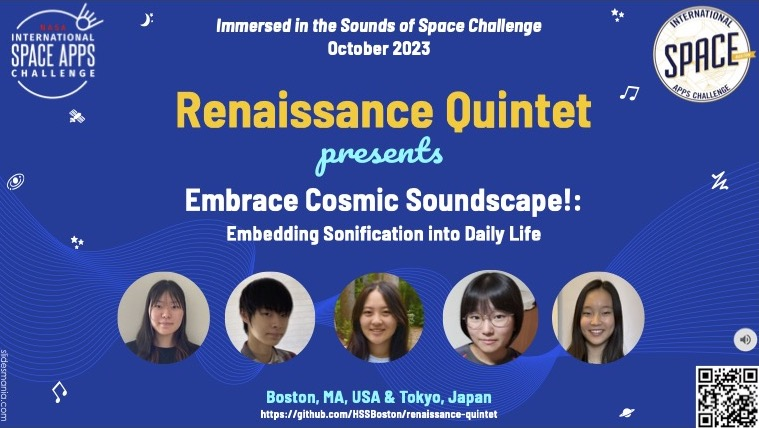

  

We are a team of 5 students who participated in the [2023 NASA Space Apps Challenge](https://2023.spaceappschallenge.org/):

- Sarasa Ouchi
- Banri Ouchi
- Hanna Suzuki
- Akari Takekawa
- Alyssa Yasuhara

NASA Space Apps Challenge is an annual hackathon event (or an innovation incubation and civic engagement program) where NASA puts out about 30 challenges for participants around the world to develop innovative solutions.

We participated in the [Boston division](http://spaceappsboston.org/) of Space Apps and won the **1st place** and **Kintone Award** there! We are excited to be be one of global nominees.

Our team worked on the [Immersed in the Sounds of Space](https://www.spaceappschallenge.org/2023/challenges/immersed-in-the-sounds-of-space/). We built "smart" mirrors and picture frames, each of which downloads NASA's sonification data, replays its audio portion with a speaker and displays its video/image portion with a digital display. We also designed a new sonification algorithm that sonifies constellations. Our ultimate goal is to embed sonification to daily life and better disseminate cosmic soundscape. 

This web site provides hardware and software setup guide, circuit diagrams, and ready-to-run Python programs. You can immediately learn how to reproduce our devices and how to use our constellation sonifier. We hope you find this project interesting and useful and then learn something about sonification. 

- [Official team web page](https://www.spaceappschallenge.org/2023/find-a-team/tba-sonification/) at SpaceAppsChallenge.org
- [7-page project summary](https://docs.google.com/presentation/d/1awytJN010U5o6ZXexxGZbdyq2TkI2z6lOsYLfgzPcUU/edit?usp=sharing)
- [Oral presentation video](https://youtu.be/knsCNAubOXA) for Boston local judging
- [Oral Presentation slides](https://docs.google.com/presentation/d/1Maam6cC-NhNnfkUsv-rYOL-KNHO1_VBS-8JYwZ-wXmE/) at Boston local judging
- Smart mirrors and picture frames
- [Constellation Sonifier](sonifier/)
- Hardware setup: Required hardware, LED matrix wiring, e-paper wiring, circuit diagrams, and DIY tips.
- Software code: Raspberry Pi OS setup, required software libraries, online service accounts, and Python code.
<!-- Press coverage https://youtu.be/PuvCo-NGgwE -->

### Project Summary:

Sonification means transforming astronomical data (telescope images) to sound. It intends to allow people to inspect and communicate astronomical data with the auditory sense as well as the visual sense. Early research studies show its effectiveness in understanding astronomical data. NASA and its partners have carried out various sonification projects with their telescopes such as the Webb, Chandra, Hubble and Spitzer telescopes.

Sonification is interesting and important in many ways for many scientists and space enthusiasts. It's like renaissance in interpreting astronomical data. However, most of the general public don't know about it, probably because sonified sounds are distributed through "pull" media such as YouTube. In fact, most of our our parents, grandparents, friends and teachers didn’t.

Therefore, this project aims to embed sonification to daily life and better disseminate cosmic soundscape to the general public by leveraging sonification data in everyday objects such as mirrors, picture frames, refrigerator doors and kitchen counters. We built "smart" mirrors and picture frames that "push" sonification data to nearby people. Each of them downloads NASA's sonification data, replays its audio portion with a speaker and displays its video/image portion with a digital display.  Our devices are integrated with the cloud; their operational settings are stored in a cloud data storage, and they can be updated with any Internet-connected devices. 

This project also aims to implement a new sonification algorithm. It's design is driven by music theory, and it is intended to sonify the stars in constellations. Our algorithm analyzes the location of each star in a constellation, produces a musical score that consists of multiple voices (tracks) and synthesizes different instrument sounds (e.g. piano, violin and cello sounds) for different tracks. When mixing multiple tracks, the algorithm produces stereo sound to vividly express "chamber music of a constellation". Our ultimate goal is to help promote "sound logos" of constellations and help any astronomy learners, even toddlers, conceptualize constellations in a new way - whether or not they are familiar with astronomy.

