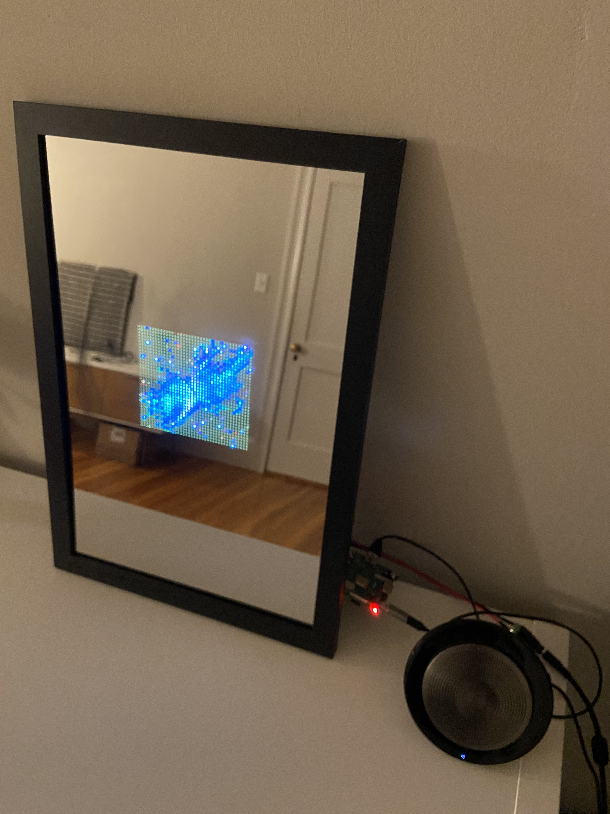
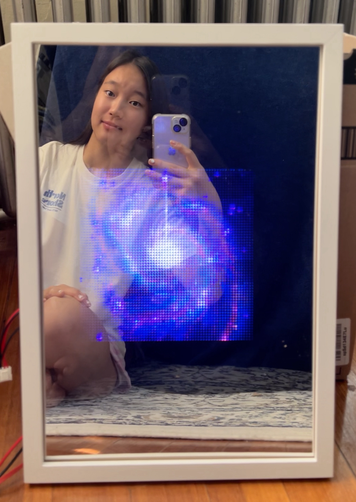
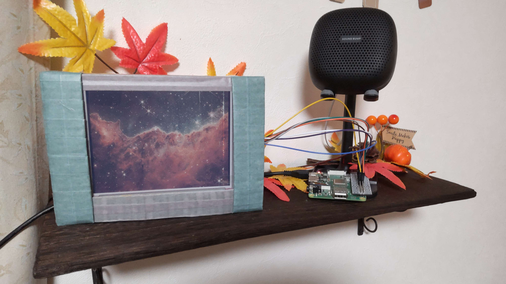
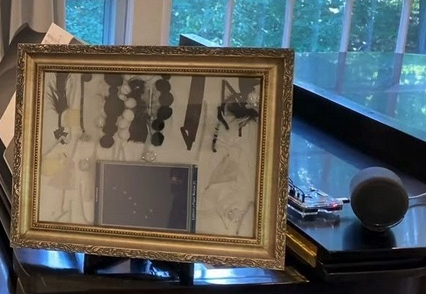

## Smart Mirrors

We made smart mirrors, each of which is built with a half-reflective mirror and a Raspberry Pi computer. Raspberry Pi is connected to a 64x64 LED matrix board and a Bluetooth speaker. It also interacts with a cloud database called Kintone. 

</a>

</a>

## Digital Photo Frames

We also made digital photo frames with Raspberry Pi computers. Raspberry Pi is connected to an e-paper display and a Bluetooth speaker. It interacts with Kintone (cloud database) as well. 

</a>

</a>

