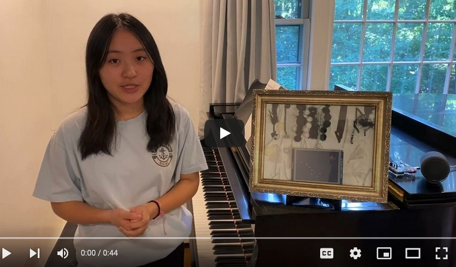

## Constellation Sonifier

Our sonifier is intended to sonify the stars in constellations, rather than complex telescope images. Starting with simpler datasets, we would like to carefully analyze and validate sonification algorithms. Note that our sonifier still uses three-dimensional data - two-dimensional space with an extra dimension for the brightness of stars (apparent magnitude).

The design of our sonification algorithm is driven by music theory. Given a set of stars in a constellation, we make a grid on it. We interpret the middle line as the third line of a five-lined staff and place four extra ledger lines above and below.

The following picture shows the big dipper as an example constellation. It's Alaska's state flag, which contains the Polaris as well as seven stars.

The following picture shows how to place a grid on it and how to determine a five-lined staff and eight extra ledger lines.

Given a five-lined staff, we place different clefs to produce different voices (tracks). The following picture shows a score of the big dipper, which contains three voices (tracks) with treble, alto and bass clefs.

For each track, we generate a MIDI-like data structure that contains the onset time, note number, velocity and gate time for each note in a score. The brightness of a star impacts the velocity of its corresponding note. Our algorithm can also produce a chord from a single note, as preferred. Then, we synthesize a particular instrument sound for each note, according to a given clef. For example, piano and violin sounds may be synthesized with the treble clef, viola sound may be synthesized with the alto clef, and cello sound may be synthesized with the bass clef.

When mixing multiple tracks, our algorithm can perform fade-in effect and produce stereo sound to vividly express "chamber music of a constellation".

Our sonifier generates the image of a generated score with the ABC music notation and uploads it to a cloud data storage called Kintone, along with WAV file, MP3 file and constellation image. We have tested our algorithm with two constellatios: the big dipper and the orion. See the "project demo" (7-slide project summary) for more details, synthesized sounds and demonstration videos.

We all learn the big dipper and other constellations only through visualization (e.g., picture books and encyclopedias). Why not with sonification? We believe sonification is effective for anyone who learn constellations. In this context, our sonifier can/should be useful for any astronomy learners (both grown-ups and kids, even toddlers) to conceptualize constellations in a new way. Our ultimate goal is to help promote "sound logos" of constellations.

